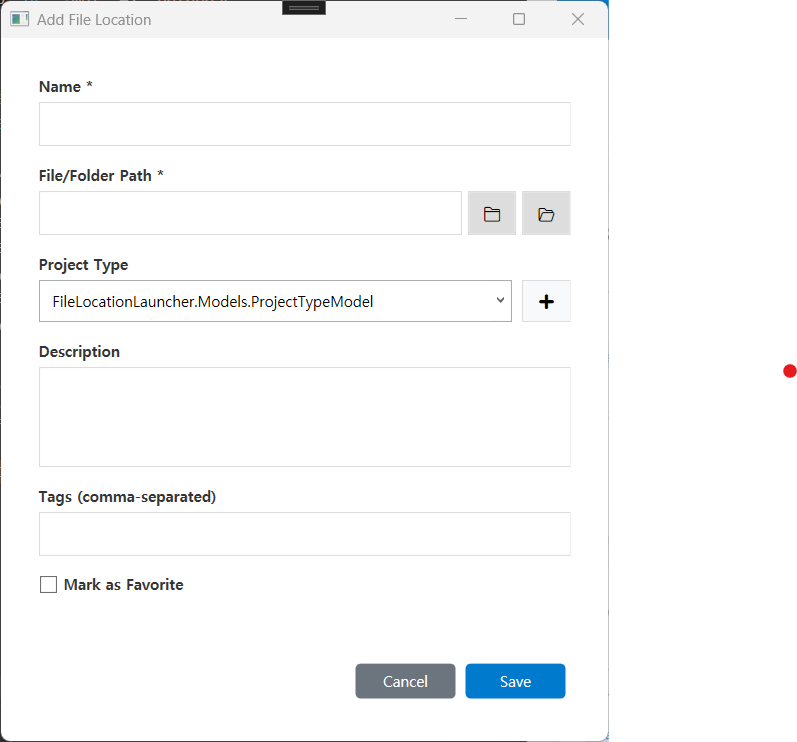

# File Location Launcher

This program was created for personal use. Context Switching takes a surprisingly long time because I develop multiple languages ​​and multiple projects at the same time.
To minimize this, I created apps like Launch Pad and Dashboard to reduce unnecessary time loss for basic environment configuration. I created this program.

이 프로그램은 개인적으로 사용하기 위해서 만든 프로그램입니다. 
 다양한 언어와 여러 프로젝트를 동시에 개발을 하다보니 Context Switching에 의외로 시간이 많이 걸립니다.
이를 최소화 하기위해서 Launch Pad, Dashboard 같은 엡을 만들어서 기본적인 환경구성에 들어가는 불필요한 시간의 손실을 줄여보고자 이 프로그램을 만들어 봤습니다.

# WPF Application
- CommunityToolkit.Mvvm
- Dependency Injection

